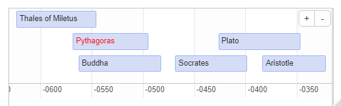
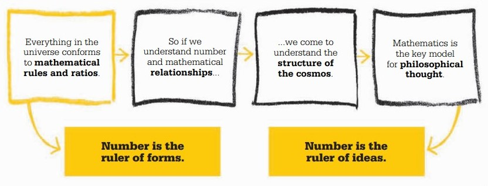

```{r setup, include=FALSE}
knitr::opts_chunk$set(echo = FALSE)
```

## What is Pythagoreanism?

Pythagoreanism is a school of philosophy based on the beliefs of the Pre-Socratic philosopher Pythagoras and his followers, often called Pythagoreans, which was formed around the fifth century BCE.

Little is known about Pythagoras, especially since he left no writings himself, however he created an academy, which can also be called a cult, where his followers lived in a commune and recorded his ideas. The reason for this is that Pythagoras believed that following strict living rules will lead to freedom from the cycle of reincarnation, which is his goal of life. 

However, he is best known for the Pythagorean theorem:

<center> $c^{2} = a^{2} + b^{2}$ \center

## The two types of Pythagoreans

Besides his mathematical and scientific approach, Pythagoras was an incredibly religious and superstitious man. These two approaches seem contradictory, which is why his followers were eventually split into two categories:

 Akousmatikoi |  Mathematikoi  
 :-----------: | :-----------: 
 Listeners | Learners
 Focused on spiritual teachings | Focused on scientific teachings 
Associated with Asceticism | Associated with Plato 
Outer circle, not vegetarian, living in their homes, not as trusted | Inner circle, vegetarian, living in the commune with no personal possessions 

## Timeline 

```{r, echo=FALSE, out.width = "100%", out.height = "100%", fig.cap="*Timeline of some influential philosophers who were active before and after Pythagoras*", out.extra='style="background-color:#ADD8E6; padding:10px; display: inline-block;"'}


```
----------
Aristotle referred to Pythagoras's followers as **“the so-called Pythagoreans”**, questioning their connection with Pythagoras. 
----------

# Some of the main ideas of Pythagoreanism

## {data-background=#515151}
<div style="color:white;">
* Numbers 

Pythagoras and his followers believed that the basis of the universe and everything in it are numbers. This idea is not so different from the Milesian idea, since it still agrees that the universe is made from only one substance, but in Pythagoras case he replaces the substance with a form. 

This idea led to a very important conclusion in mathematics, which is that numbers exist on their own and do not need to be assigned to something, like an object. However, they believed that only whole numbers exist, so the ratio 1.5:2 would be written as 3:4.

What forced them to change this belief is the Pythagorean theorem, since a triangle that has both sides of length 1 would produce a hypotenuse that has the value of an irrational number, $\sqrt2$. There are no ratios of whole numbers that would produce this, which forced Pythagoreans to change their beliefs.
</div>

## {data-background=#515151}
<div style="color:white;">
* Music

Nevertheless, the whole number ratios have been useful to Pythagoras, but in a different context. He decided to explore the relationship between notes that sound pleasing, which is ruled by those ratios. It is said that Pythagoras noticed this while listening to blacksmiths. One had an anvil half the size of the other, and the sounds they made when hit with a hammer were exactly an octave (eight notes) apart. 

However, this story is very unlikely, Pythagoras probably realized the relationships while experimenting with his instruments. But the most important thing is his conclusion, and for Pythagoras this was proof that mathematics and its' rules are applicable to the real world and nature. Besides that, this later led to the development of a concept called harmonic series.
</div>

## {data-background=#515151}
<div style="color:white;">
* Astronomy

Pythagoras then started to apply these ideas to the whole universe, showing the harmonic relationship of the stars, planets, and elements. This was eagerly taken up by medieval and Renaissance astronomers, who developed whole theories around the idea of the music of the spheres.

* Less accepted ideas

There are many other ideas that Pythagoras and his followers believed in, however most believe that they are too much. Even though they did discover the concept of squares and cubes, but they also assigned certain characteristics to them. For example, even numbers are good, while odd numbers are bad, and certain numbers have qualities where the number four represents justice, and so on. 

</div>

## {data-background=#515151}

<p style="color: white; font-size: 30pt; font-style: italic;"> "*Reason is immortal, all else mortal.*" </p>

<p style="color: white; font-style: oblique; text-align: right; font-size: 25pt;">--Pythagoras</p>

----------
{width=765px; height=400px;}
----------

## {data-background=#515151}
<div style="color:white;">
<p style="font-size: 30pt;">Conclusion</p>

Even though some of these ideas are not as clear or accepted, Pythagoras was very influential due to his way of thinking. He represents one of the first philosophers who asked questions about our surroundings and the universe in a critical way. He also established deductive reasoning and marked the beginning of many concepts that we improved on and use today, especially in mathematics. It is true that all of his followers disappeared fairly quickly, but his ideas were adopted by other schools and philosophers, and some are alive today.
</div>